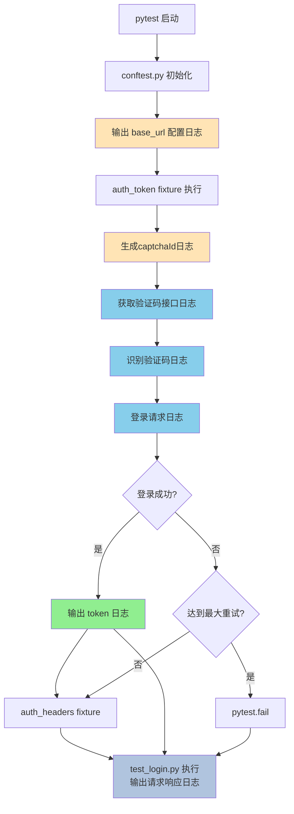

# API 自动化测试框架搭建计划（方案B）

## 相关计划索引

- 本文：原始搭建计划（保留作历史参照）
- [api-test-framework 技能同步计划](./api-test-framework-skill-sync.plan.md) — **当前主线**，将 `common/` + `conftest` 沉淀到仓库技能，分通用层 / 适配层
- 其他模块计划见同目录 `*.plan.md` 文件

---

## 目标

基于 api-test-framework 搭建监控平台 API 自动化测试框架，以用户登录接口为例实现验证码识别和循环重试机制。

**方案B特点**：认证逻辑集中在 `conftest.py` 的 `auth_token` fixture 中统一管理，正向登录自动完成，测试用例层只编写负向场景。

---

## 目录结构

```
jkpt_api_test/
├── api_test_framework/     # 框架核心（从 api-test-framework 复制）
├── common/                 # 公共工具层
│   ├── __init__.py
│   ├── requests_util.py   # BaseRequest 封装
│   ├── yaml_util.py       # YAML 读写工具
│   ├── ipconfig.py        # IP 获取工具
│   ├── common_data.py     # 公共数据工具
│   └── captcha_util.py    # 验证码识别工具
├── conftest.py             # 核心配置（认证逻辑在此）
├── pytest.ini
├── pyproject.toml
├── run.py
├── extract.yaml
├── logs/                   # 日志文件目录
├── testcases/              # 测试用例
│   └── test_login.py      # 登录接口测试用例（负向场景）
├── yaml/                   # 测试数据
│   └── login.yaml         # 登录接口测试数据（负向场景）
└── plan/
    └── README.md          # 本计划文档
```

---

## 控制台日志输出设计

### 日志内容清单

执行时控制台会输出：

```
[配置] base_url: http://back.tdwtv2.pg8.ink
[认证] 正在获取Token...
[验证码] captchaId: 174609850933812345
[验证码] 识别结果: bm3uw
[请求] POST http://back.tdwtv2.pg8.ink/api/monitor/web-user/login
[参数] account=tmn&password=******&captcha=bm3uw&captchaId=174609850933812345
[响应] {"code": 0, "msg": "success", "data": {"token": "eyJhbGciOiJI..."}}
[认证] Token获取成功: eyJhbGciOiJI...（前20位）
[请求] POST http://back.tdwtv2.pg8.ink/api/monitor/web-user/login
[参数] account=&password=4f9cb165cd6249312e5804fcf9416c5e&captcha=test&captchaId=123456789012345678
[响应] {"code": 1001, "msg": "账号不能为空"}
[断言] 预期 code=1001, 实际 code=1001, 通过
```

---

## 流程图



---

## 实施步骤

### 步骤 1：初始化项目结构

1. 从 `api-test-framework/api-test-framework/` 复制框架核心文件到项目根目录
2. 创建目录：`common/`、`testcases/`、`yaml/`、`logs/`、`temps/`、`reports/`

### 步骤 2：安装依赖

```bash
pip install pytest requests pyyaml jsonpath-ui ddddocr pillow allure-pytest pytest-rerunfailures
```

### 步骤 3：创建 `common/captcha_util.py`

```python
# common/captcha_util.py
import ddddocr

class CaptchaRecognizer:
    def __init__(self):
        self.ocr = ddddocr.DdddOcr(show_ad=False)

    def recognize(self, image_bytes: bytes) -> str:
        """识别验证码图片，返回验证码字符串"""
        result = self.ocr.classification(image_bytes)
        return result.strip()

    def recognize_from_response(self, response) -> str:
        """直接从 HTTP 响应内容识别验证码"""
        return self.recognize(response.content)
```

---

### 步骤 4：配置 `conftest.py`（核心变更）

```python
# conftest.py
import pytest
import time
import random
import logging
from common.requests_util import BaseRequest
from common.case_report_util import assert_response
from common.yaml_util import clear_yaml
from common.captcha_util import CaptchaRecognizer

# ==================== 日志配置 ====================
logging.basicConfig(
    level=logging.INFO,
    format='[%(levelname)s] %(message)s',
    handlers=[
        logging.StreamHandler()  # 输出到控制台
    ]
)
logger = logging.getLogger(__name__)

# ==================== 全局实例 ====================
http = BaseRequest()
ocr = CaptchaRecognizer()

# ==================== 配置 ====================
def pytest_configure(config):
    config.base_url = "http://back.tdwtv2.pg8.ink"
    logger.info(f"[配置] base_url: {config.base_url}")

@pytest.fixture(scope="session")
def base_url(pytestconfig):
    return pytestconfig.base_url

# ==================== 认证核心：auth_token fixture ====================
def generate_captcha_id():
    """生成18位无0开头的captchaId"""
    timestamp = str(int(time.time() * 1000))
    random_5 = str(random.randint(10000, 99999))
    return timestamp + random_5

@pytest.fixture(scope="session")
def auth_token(base_url):
    """通过验证码识别获取token，带循环重试机制"""
    logger.info("[认证] 正在获取Token...")
    max_attempts = 5

    for attempt in range(1, max_attempts + 1):
        logger.info(f"[认证] 登录尝试 {attempt}/{max_attempts}")

        # 步骤1：获取验证码
        captcha_id = generate_captcha_id()
        logger.info(f"[验证码] captchaId: {captcha_id}")
        captcha_url = f"{base_url}/api/monitor/captcha?captchaId={captcha_id}"

        resp = http.send_request(
            method="get",
            url=captcha_url,
            case_name="获取验证码",
            log_level="full"  # 详细日志
        )
        logger.info(f"[验证码] 图片获取成功")

        # 步骤2：识别验证码
        captcha_text = ocr.recognize_from_response(resp)
        logger.info(f"[验证码] 识别结果: {captcha_text}")

        # 步骤3：执行登录
        login_url = f"{base_url}/api/monitor/web-user/login"
        login_data = {
            "account": "tmn",
            "password": "4f9cb165cd6249312e5804fcf9416c5e",
            "captcha": captcha_text,
            "captchaId": captcha_id
        }

        logger.info(f"[请求] POST {login_url}")
        logger.info(f"[参数] account=tmn&password=******&captcha={captcha_text}&captchaId={captcha_id}")

        login_resp = http.send_request(
            method="post",
            url=login_url,
            params=login_data,
            case_name="用户登录",
            log_level="full"  # 详细日志
        )

        json_data = assert_response(
            {"name": "用户登录", "expected": {"code": 0}},
            login_resp,
            biz_context={"请求参数": {"account": account}},
        )
        logger.info(f"[响应] {json_data}")

        code = json_data["code"]

        if code == 0:
            token = json_data["data"]["token"]
            logger.info(f"[认证] Token获取成功: {token[:20]}...")
            return token
        else:
            msg = json_data.get("msg") or "未知错误"
            logger.warning(f"[认证] 登录失败: code={code}, msg={msg}")
            if attempt < max_attempts:
                logger.info("1秒后重试...")
                time.sleep(1)

    pytest.fail("登录失败，已重试5次仍未成功")

# ==================== 认证头：auth_headers fixture ====================
@pytest.fixture(scope="session")
def auth_headers(auth_token):
    """构造认证请求头"""
    logger.info(f"[认证] auth_headers已设置")
    return {"Authorization": f"{auth_token}"}

# ==================== 自动清理 ====================
@pytest.fixture(scope="session", autouse=True)
def clear_data_per_session():
    logger.info("[测试] 开始执行测试用例")
    clear_yaml()
    yield
    logger.info("[测试] 测试用例执行完成")
```

---

### 步骤 5：编写登录接口负向测试 YAML 数据

```yaml
# yaml/login.yaml
login_cases:
  - name: "账号为空"
    account: ""
    password: "4f9cb165cd6249312e5804fcf9416c5e"
    captcha: "test"
    captchaId: "123456789012345678"
    expected:
      code: 1001
      error_msg: "账号不能为空"

  - name: "密码为空"
    account: "tmn"
    password: ""
    captcha: "test"
    captchaId: "123456789012345678"
    expected:
      code: 1002
      error_msg: "密码不能为空"

  - name: "验证码错误"
    account: "tmn"
    password: "4f9cb165cd6249312e5804fcf9416c5e"
    captcha: "wrong"
    captchaId: "123456789012345678"
    expected:
      code: 1003
      error_msg: "验证码错误"

  - name: "账号不存在"
    account: "nonexist"
    password: "4f9cb165cd6249312e5804fcf9416c5e"
    captcha: "test"
    captchaId: "123456789012345678"
    expected:
      code: 1004
      error_msg: "账号不存在"
```

---

### 步骤 6：编写登录接口负向测试用例

```python
# testcases/test_login.py
import pytest
from common.case_report_util import assert_response
from common.requests_util import BaseRequest
from common.yaml_util import read_yaml

class TestLoginAPI:
    """
    登录接口测试（负向场景）

    正向登录流程已在 conftest.py 的 auth_token fixture 中自动完成
    本测试用例仅覆盖负向场景
    """

    test_data = read_yaml("./yaml/login.yaml")["login_cases"]

    @pytest.mark.parametrize("case", test_data)
    def test_login_negative(self, base_url, case):
        """登录接口负向测试"""
        url = f"{base_url}/api/monitor/web-user/login"
        payload = {
            "account": case["account"],
            "password": case["password"],
            "captcha": case["captcha"],
            "captchaId": case["captchaId"]
        }

        print(f"\n[用例] {case['name']}")
        print(f"[请求] POST {url}")
        print(f"[参数] {payload}")

        res = BaseRequest().send_request(
            method="post",
            url=url,
            params=payload,
            case_name=case["name"],
            log_level="full"  # 详细日志
        )

        json_data = assert_response(
            case,
            res,
            biz_context={"请求参数": payload},
        )
        print(f"[响应] {json_data}")

        code = json_data["code"]
        msg = json_data.get("msg")

        if code == 0:
            print(f"[断言] 预期失败，实际成功")
            assert code == case["expected"]["code"]
        else:
            print(f"[断言] 预期 code={case['expected']['code']}, 实际 code={code}")
            print(f"[断言] 预期 msg={case['expected']['error_msg']}, 实际 msg={msg}")
            assert code == case["expected"]["code"]
            assert case["expected"]["error_msg"] == msg
```

---

### 步骤 7：创建配置文件

**pytest.ini**:
```ini
[pytest]
addopts = -vs --alluredir=./temps --clean-alluredir --reruns 3 --reruns-delay 1
testpaths = testcases
python_files = test_*.py
python_classes = Test*
python_functions = test_*
log_cli = true
log_cli_level = INFO
log_cli_format = [%(levelname)s] %(message)s
```

**run.py**:
```python
"""run.py — 一键运行入口"""
import os, time, pytest

if __name__ == '__main__':
    pytest.main()
    time.sleep(3)
    os.system("allure generate ./temps -o ./reports --clean")
    print("\n报告已生成: ./reports/index.html")
```

---

## 控制台日志输出示例

执行 `pytest -vs` 时，控制台会显示：

```
============================= test session starts ==============================
[配置] base_url: http://back.tdwtv2.pg8.ink
[测试] 开始执行测试用例

[认证] 正在获取Token...
[认证] 登录尝试 1/5
[验证码] captchaId: 174609850933812345
[验证码] 图片获取成功
[验证码] 识别结果: bm3uw
[请求] POST http://back.tdwtv2.pg8.ink/api/monitor/web-user/login
[参数] account=tmn&password=******&captcha=bm3uw&captchaId=174609850933812345
[响应] {"code": 0, "msg": "success", "data": {"token": "eyJhbGciOiJIUzUxMiJ9..."}}
[认证] Token获取成功: eyJhbGciOiJIUzUxMiJ9...
[认证] auth_headers已设置

testcases/test_login.py::TestLoginAPI::test_login_negative[账号为空] STARTED
[用例] 账号为空
[请求] POST http://back.tdwtv2.pg8.ink/api/monitor/web-user/login
[参数] {'account': '', 'password': '4f9cb165cd6249312e5804fcf9416c5e', 'captcha': 'test', 'captchaId': '123456789012345678'}
[响应] {'code': 1001, 'msg': '账号不能为空'}
[断言] 预期 code=1001, 实际 code=1001
[断言] 预期 msg=账号不能为空, 实际 msg=账号不能为空
PASSED

testcases/test_login.py::TestLoginAPI::test_login_negative[密码为空] STARTED
...
```

---

## 关键实现说明

| 功能 | 实现位置 | 说明 |
|------|----------|------|
| base_url 日志 | pytest_configure | 输出配置值到控制台 |
| captchaId 日志 | auth_token fixture | 每次请求前打印 |
| 验证码识别日志 | auth_token fixture | 打印识别结果 |
| 请求参数日志 | auth_token fixture | 打印完整 URL 和参数（密码脱敏） |
| 响应结果日志 | auth_token fixture | 打印完整 JSON 响应 |
| token 日志 | auth_token fixture | 打印 token 前20位 |
| 用例请求日志 | test_login.py | 打印用例的请求参数 |
| 用例响应日志 | test_login.py | 打印用例的响应结果 |
| 断言结果日志 | test_login.py | 打印预期 vs 实际 |

---

## 待创建文件清单

| 文件路径 | 说明 |
|----------|------|
| `common/__init__.py` | Python 包标识文件 |
| `common/captcha_util.py` | ddddocr 验证码识别封装 |
| `conftest.py` | pytest 配置、认证 fixture、详细日志 |
| `yaml/login.yaml` | 登录接口测试数据（负向场景） |
| `testcases/test_login.py` | 登录接口测试用例（负向场景） |
| `pytest.ini` | pytest 配置（含日志配置） |
| `pyproject.toml` | 项目配置文件 |
| `run.py` | 测试运行入口 |
| `extract.yaml` | 变量提取存储文件 |