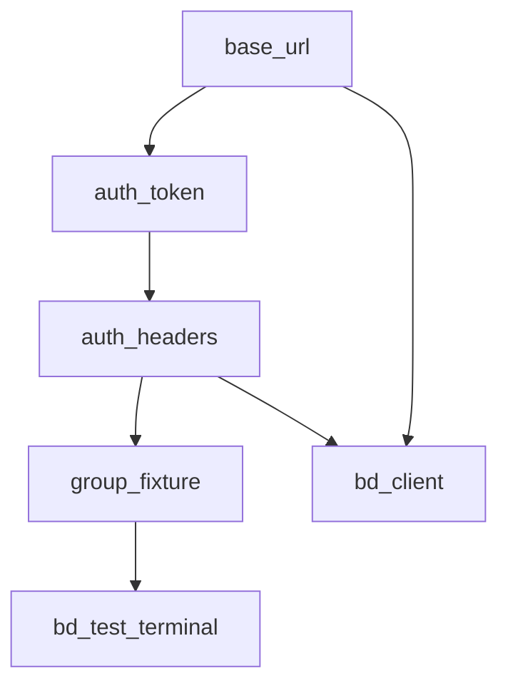

# 仓库技能与 common 持续同步 — 可执行计划

## 目标

以 **jkpt_api_test 真实运行栈**（`common/` + `conftest.py` + 模式 A/B 用例）为唯一真相源，持续沉淀到 [skills/api-test-framework/](../../skills/api-test-framework/)，使 AI 生成用例时 **import 固定、模板可复制、无虚构 API**。

**不在本计划范围**：补齐 `api_test_framework/run_case`、`pytest_plugin`、`OpenAPI 生成器（除非单独立项）。

---

## 分层设计原则（扩展性保障）

技能分两层，**确保通用层可迁移到其他项目**：

| 层 | 内容 | 放哪里 | 跨项目复用 |
|----|------|--------|-----------|
| **通用层** | `common/*.py` 全部方法（含协议层）、模式 A/B 模板、检查清单 | `SKILL.md` + `methods-reference.md` + `assets/templates/` | ✅ 直接复制 |
| **适配层** | jkpt 专属 fixture、YAML 命名约定、Cursor 规则 | `references/conftest-jkpt.md` + `references/yaml-conventions.md` + `.cursor/rules/jkpt-api-test.mdc` | ❌ 仅 jkpt，其他项目参考格式自建 |

**关键判断**：`common/` 内所有模块（包括 `bd_protocol_client`、`protocol_*`）均属**通用工具层**，统一写入 `methods-reference.md`；项目专属的是 `conftest.py` 中的 fixture（绑定了具体账号、URL、业务数据结构）。

其他项目复用路径：复制 `SKILL.md` + `methods-reference.md` + `assets/templates/`，自建 `references/conftest-{proj}.md`。

---

## 成功标准（验收）

- [ ] 新接口用例仅 `@` 仓库技能即可生成，风格与 [test_location_controller.py](../testcases/test_location_controller.py) 一致
- [ ] `methods-reference.md` 覆盖全部 `common/*.py` 对外 API（含协议层）
- [ ] `references/conftest-jkpt.md` 列出全部 session fixture 及依赖链
- [ ] SKILL 中 `pytest_plugin` / 模式 C 标为 **勿生成**
- [ ] `.cursor/rules` 强制 jkpt 走仓库技能，屏蔽全局 `~/.cursor/skills/api-test-framework`
- [ ] `拟改动范围说明.md` 已归档或删除，由 `CHANGELOG.md` 替代
- [ ] 跑通 1 个 HTTP 代表用例 + 1 个协议代表用例（若存在）

---

## 阶段总览


| 阶段 | 工期估 | 产出 |
|------|--------|------|
| 0 基线冻结 | 0.5h | 虚文档标注、CHANGELOG 初版 |
| 1 文档补齐 | 2–3h | conftest-jkpt、yaml-conventions、协议章节 |
| 2 Cursor 规则 | 0.5h | `.cursor/rules/jkpt-api-test.mdc` |
| 3 代码提取 | 按需 | `common/location_util.py` 等 |
| 4 模板同步 | 1h | templates + SKILL 检查清单 |
| 5 流程固化 | 0.5h | PR 检查说明、README 链接 |

---

## 阶段 0：基线冻结（先做）

### 任务 0.1 标注「未实现 / 勿生成」

**文件**：[SKILL.md](../api-test-framework/api-test-framework/SKILL.md)、[methods-reference.md](../api-test-framework/api-test-framework/references/methods-reference.md)

**操作**：

1. 在 SKILL 顶部增加 **jkpt 标准栈** 声明：
   - 手写普通 REST 用例：`common.requests_util` + `assert_response`；底层 `assert_api_result` 仅由公共层调用
   - 禁止：`api_test_framework.run_case`、`pytest_plugins = ["api_test_framework.pytest_plugin"]`
2. `methods-reference.md` 第 7 节 `pytest_plugin` 标题改为「未实现（勿生成）」或整节移至附录并加删除线说明
3. 模式 C 章节标题加前缀：`[可选/未使用]`

**验收**：全文搜索 `run_case`，SKILL 中均有「jkpt 默认不用」说明。

### 任务 0.2 初始化 CHANGELOG

**新建**：`api-test-framework/api-test-framework/CHANGELOG.md`

```markdown
# Changelog

## [Unreleased]
### Added
- （本计划执行后逐条填写）

### Deprecated
- 模式 C / run_case（jkpt 未使用）
- api_test_framework/pytest_plugin（文件不存在）
```

### 任务 0.3 归档拟改动说明

**操作**：将 [拟改动范围说明.md](../api-test-framework/api-test-framework/拟改动范围说明.md) 移至 `api-test-framework/api-test-framework/archive/拟改动范围说明.md`，或在文首加「已完成，见 CHANGELOG」。

**验收**：新人不会误以为文档待写。

---

## 阶段 1：文档补齐（核心）

### 任务 1.1 新建 `references/conftest-jkpt.md`

**内容清单**（对照 [conftest.py](../conftest.py) 实读填写）：

| Fixture | scope | 依赖 | 用途 |
|---------|-------|------|------|
| `base_url` | session | pytestconfig | API 根地址 |
| `accept_language` | session | pytestconfig | Accept-Language |
| `auth_token` | session | base_url | 验证码登录，最多 5 次重试 |
| `auth_headers` | session | auth_token, accept_language | Authorization + 语言头 |
| `group_fixture` | session | base_url, auth_headers | 测试分组 ID |
| `terminal_types` | session | base_url, auth_headers | 终端类型列表 |
| `bd_test_terminal` | session | base_url, auth_headers, group_fixture | 北斗测试终端 addr |
| `bd_client` | session | base_url, auth_headers | BDProtocolClient 实例 |
| `clear_data_per_session` | session autouse | — | 清空 extract.yaml |
| `cleanup_test_data` | session autouse | group_fixture 等 | 会话结束清理终端/分组 |

**另写**：

- `generate_captcha_id()` 规则
- `pytest_runtest_makereport`：失败时附 Allure（请求/响应/错误）
- 辅助函数：`get_terminals_by_group`、`cleanup_terminals_batch`、`delete_groups_in_order`（仅 conftest 内用，标注「用例勿直接调」）

**依赖图**（mermaid，写入该 md）：



**验收**：AI 生成用例时 fixture 名零臆造。

### 任务 1.2 新建 `references/yaml-conventions.md`

**内容**（基于现有 yaml）：

- 顶层 key 命名：`{module}_{action}_cases`（例：`location_list_cases`）
- 字段：`name`、`scenario`、`expected.code`、正向 `expected.msg` / 负向 `expected.error_msg`、`no_auth`
- 占位符：`{{bd_test_terminal}}` → 由 testcase 或 conftest 解析
- 时区：Asia/Shanghai 当天窗口（参考 location 用例注释）
- **不采用** 全局 Cursor 技能的 `version: "1.0"` + `assertions[]` 格式

**验收**：与 [test_location_controller.yaml](../yaml/test_location_controller.yaml) 字段一一对应。

### 任务 1.3 增补协议层文档（通用层）

> 协议层属于 `common/` 工具，写入 **`methods-reference.md`** 新章节；SKILL.md 只增一节说明「何时用协议层」。其他项目若无北斗协议可直接忽略该章。

**写入位置**：`references/methods-reference.md` 新增章节  
**对照代码**：

| 模块 | 要点 |
|------|------|
| [bd_protocol_client.py](../common/bd_protocol_client.py) | 11 种 `send_*`；仅需 `from_addr` 参数 |
| [protocol_transport.py](../common/protocol_transport.py) | `BDProtocolTransport` 底层发送 |
| [protocol_codec.py](../common/protocol_codec.py) | HEX 编解码、`resolve_phone_hex`、`random_point`、`random_trajectory` |
| [protocol_types.py](../common/protocol_types.py) | `GeoPoint`、`ProtocolSendResult` 数据类 |

**方法表**（写入 methods-reference）：

- `send_text_92` / `send_text_93`
- `send_voice_a6`
- `send_alarm_13` / `send_safe_14`
- `send_location_a4` / `send_location_15`
- `send_image_aa`
- `send_alarm_ee` / `send_safe_e1`
- `send_sms_94`

**边界说明**（写入 methods-reference + SKILL 协议节）：

- 普通 HTTP 信封断言用 `assert_response`；协议发送用 `bd_client.send_*`，返回值看 `ProtocolSendResult`
- `bd_client` 实例由 `conftest.py` 的 `bd_client` fixture 注入（见 `conftest-jkpt.md`）
- 坐标缺省：中心点 (113.466203, 23.170439) 半径 100m 随机（模块自动处理）

**验收**：methods-reference 中能写出 `bd_client.send_alarm_13(from_addr=bd_test_terminal)` 最小示例；SKILL 中不出现具体坐标或 fixture 绑定写法（那属适配层）。

### 任务 1.4 同步 SKILL 文件结构骨架

**更新** SKILL 末尾「项目文件结构」：

```
common/
├── requests_util.py
├── allure_assert_util.py
├── logger_util.py
├── yaml_util.py
├── captcha_util.py
├── common_data.py
├── ipconfig.py
├── bd_protocol_client.py      # 新增
├── protocol_transport.py        # 新增
├── protocol_codec.py            # 新增
└── protocol_types.py            # 新增
```

**验收**：与 `common/` 目录列表一致。

---

## 阶段 2：Cursor 规则（强制 AI 读仓库技能）

### 任务 2.1 新建 `.cursor/rules/jkpt-api-test.mdc`

**建议正文**：

```markdown
---
description: jkpt API 自动化测试生成约束
globs: testcases/**, yaml/**, common/**, conftest.py
---

# jkpt 接口测试

- 技能文档：`api-test-framework/api-test-framework/SKILL.md`
- 方法字典：`references/methods-reference.md`
- Fixture：`references/conftest-jkpt.md`
- YAML 约定：`references/yaml-conventions.md`

## 必须
- `from common.requests_util import BaseRequest`
- `from common.case_report_util import assert_response`
- 模式 A（无状态）或模式 B（CRUD）；参数化读 `./yaml/test_xxx.yaml`

## 禁止
- `api_test_framework.run_case` / 模式 C（除非用户明确要求）
- `pytest_plugins = ["api_test_framework.pytest_plugin"]`
- 全局技能 YAML `version: "1.0"` + `assertions[]` 格式
- 在用例中硬编码 token、生产 URL、真实密码
```

**验收**：在 `testcases/` 下 @ 生成用例，import 符合规则。

---

## 阶段 3：公共代码提取（按需、触发式）

### 提取门槛（满足 ≥2 条才做）

1. ≥2 个 testcase 重复 ≥5 行逻辑
2. 不用则漏测/漏 Allure 上下文
3. 有稳定 `from common.xxx import yyy`

### 任务 3.1 候选：location 查询参数组装

**来源**：[test_location_controller.py](../testcases/test_location_controller.py) 内 `_build_location_query_params`、`_resolve_bd_addr` 等

**目标**：`common/location_util.py`（新建）

**步骤**：

1. 抽取函数，保持行为不变
2. testcase 改为 import
3. 更新 methods-reference + SKILL 一节
4. CHANGELOG 记录
5. `pytest testcases/test_location_controller.py -k list -q` 验证

### 任务 3.2 后续迭代队列（ backlog ）

| 候选 | 触发条件 |
|------|----------|
| 终端/分组清理封装 | 第 3 个模块复制 conftest 清理逻辑 |
| 统一 `no_auth` headers 处理 | 第 3 个 testcase 复制 strip Authorization |
| 协议 + HTTP 组合场景模板 | 首个「先发协议再查 HTTP」用例落地后 |

**验收**：提取后原 testcase 行数减少，pytest 仍绿。

---

## 阶段 4：模板与检查清单

### 任务 4.1 更新 templates

**目录**：[assets/templates/](../api-test-framework/api-test-framework/assets/templates/)

| 模板 | 动作 |
|------|------|
| `test_case_simple.tpl.py` | 确认含 `assert_response`、`no_auth` 注释 |
| `test_case_crud.tpl.py` | 同上 |
| `test_case_yaml.tpl.py` | 文首加「jkpt 未使用，勿复制」 |
| **新建** `test_case_protocol.tpl.py` | `bd_client` + `bd_test_terminal` + 单次 `send_*` 示例 |

### 任务 4.2 更新 SKILL「Step 4 检查清单」

追加项：

- [ ] 协议用例是否注入 `bd_client` / `bd_test_terminal`
- [ ] 普通 HTTP 用例是否使用 `assert_response` 且带 `biz_context`
- [ ] YAML 顶层 key 是否与 `@pytest.mark.parametrize` 一致
- [ ] 是否误用 `run_case`

---

## 阶段 5：流程固化

### 任务 5.1 更新 plan/README.md

增加链接：

```markdown
- [api-test-framework 技能同步计划](./api-test-framework-skill-sync.plan.md)
```

### 任务 5.2 定义「改 common 必改文档」约定

写入 `api-test-framework/api-test-framework/CONTRIBUTING.md`（新建，简短）：

- 改 `common/*.py` → 至少更新 `methods-reference.md` 或 `CHANGELOG.md`
- 改 `conftest.py` fixture → 更新 `conftest-jkpt.md`
- 改 YAML 字段约定 → 更新 `yaml-conventions.md`

### 任务 5.3 验证命令

```powershell
cd c:\Users\33606\Desktop\BD_loc_mon_api_test\jkpt_api_test
pytest testcases/test_location_controller.py -q --tb=short
# 若有协议用例：
# pytest testcases/test_xxx_protocol.py -q
```

---

## 执行顺序（单人可按日拆分）

| 日次 | 任务编号 | 预计 |
|------|----------|------|
| D1 上午 | 0.1–0.3 | 0.5h |
| D1 下午 | 1.1 conftest-jkpt | 1h |
| D2 上午 | 1.2 yaml-conventions | 0.5h |
| D2 下午 | 1.3–1.4 协议 + 骨架 | 1.5h |
| D3 | 2.1 + 4.1–4.2 | 1.5h |
| D4+ | 3.x 按需提取 | 迭代 |

---

## 文件变更清单

### 通用层（跨项目可复用）

| 操作 | 路径 | 说明 |
|------|------|------|
| 修改 | `api-test-framework/api-test-framework/SKILL.md` | 标注勿生成项、增协议层说明节、更新骨架 |
| 修改 | `api-test-framework/api-test-framework/references/methods-reference.md` | 补全协议 4 模块章节 |
| 修改 | `api-test-framework/api-test-framework/assets/templates/test_case_yaml.tpl.py` | 文首标「jkpt 未使用」 |
| 确认 | `api-test-framework/api-test-framework/assets/templates/test_case_simple.tpl.py` | 含 `assert_api_result`、`no_auth` |
| 确认 | `api-test-framework/api-test-framework/assets/templates/test_case_crud.tpl.py` | 同上 |
| 新建 | `api-test-framework/api-test-framework/assets/templates/test_case_protocol.tpl.py` | 协议用例模板 |
| 新建 | `api-test-framework/api-test-framework/CHANGELOG.md` | 替代拟改动说明 |
| 新建 | `api-test-framework/api-test-framework/CONTRIBUTING.md` | 「改 common 必改文档」约定 |

### 适配层（仅 jkpt，其他项目参考格式自建）

| 操作 | 路径 | 说明 |
|------|------|------|
| 新建 | `api-test-framework/api-test-framework/references/conftest-jkpt.md` | jkpt fixture 表 + 依赖图 |
| 新建 | `api-test-framework/api-test-framework/references/yaml-conventions.md` | jkpt YAML 命名约定 |
| 新建 | `.cursor/rules/jkpt-api-test.mdc` | Cursor 生成约束（必须/禁止） |

### 归档 / 辅助

| 操作 | 路径 |
|------|------|
| 归档 | `api-test-framework/api-test-framework/拟改动范围说明.md` |
| 可选新建 | `common/location_util.py` |
| 修改 | `plan/README.md` |

**明确不改**（除非另开计划）：

- `api_test_framework/` 代码（协议文档进 methods-reference，包代码不动）
- 全局 `~/.cursor/skills/api-test-framework/`
- 现有 testcase 业务断言逻辑（除抽取 helper）

---

## 风险与回滚

| 风险 | 缓解 |
|------|------|
| 文档与代码再次漂移 | CONTRIBUTING + CHANGELOG 门禁 |
| AI 仍读全局技能 | `.cursor/rules` + 对话显式 `@api-test-framework` 仓库路径 |
| 抽取 helper 引入回归 | 抽取前后各跑目标模块 pytest |

回滚：Git 按阶段提交（建议 5 个 commit 对应阶段 0–4）。

---

## 完成后自检（复制执行）

```text
[ ] SKILL 顶部有 jkpt 标准栈声明
[ ] conftest-jkpt.md fixture 表完整
[ ] yaml-conventions 与现有 yaml 一致
[ ] 协议 send_* 共 11 个已列入 methods-reference
[ ] jkpt-api-test.mdc 已生效
[ ] test_case_yaml.tpl 已标未使用
[ ] pytest location 代表用例通过
[ ] 用 Cursor 生成一条虚拟 CRUD 用例，import 无 run_case
```
